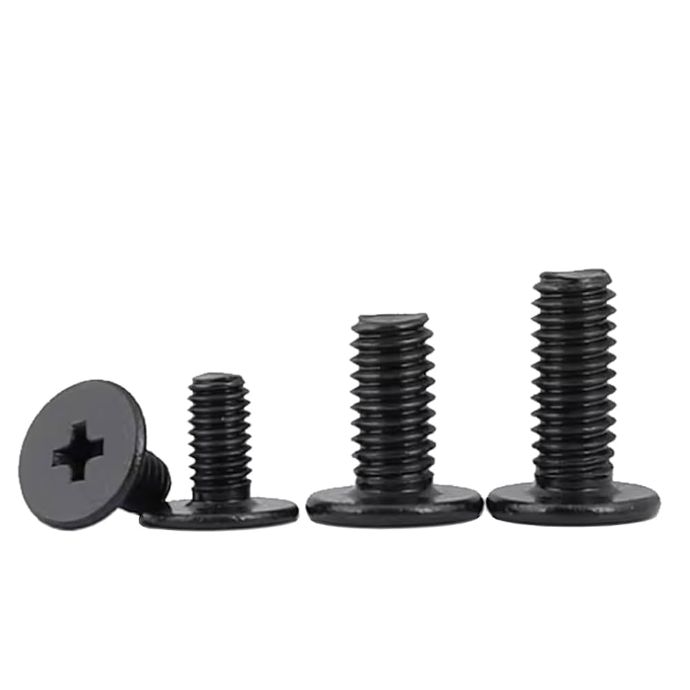

# Type65-Acrylic-Staked
Acrylic Staked case for Type65+ for those who have spare PCB and plate. 

# Hardware
The listed quantity is just enough — it’s better to grab extras just in case.
|   | Hardware | Size | Length | Quantity | Remarks |
|---|---|---|---|---|---|
| 1 | Screw | M2 | 5MM | 16 | For bottom layer and attach feet part |
| 2 | Screw | M2 | 8MM | 8 | For the feet. |
| 3 | Screw | M2 | 10MM | 12 | For top layer. |
| 4 | Screw | M2 | 14MM | 4 | For thicker bottom layer near daugther board |
| 5 | Standoff Spacer(Female to Female) | M2 | 10MM | 12 | For case layer. |
| 6 | Standoff Spacer(Female to Female) | M2 | 26MM | 4 | For the part. |
| 7 | Nut | M2 | - | 8 | 2 inside the feet; 4 for mounting daugther board. |
| 8 | Rubber feet | 22*12 MM | - | 4 | Can replaced with bumpons. |
| 9 | Gasket strip (2MM thick) | - | - | 8 | Thinner strip at the top. |
| 10 | Gasket strip (4/5MM thick) | - | - | 8 | Thicker strip at the bottom. |

Here's the type of screw, standoff, and nut I used.

# Layer 1

# Layer 2

# Layer 3

# Layer 4

# Layer 5

# Layer 6

# Layer 7

# Layer 8

# Layer 9

# Layer 10

# Left Feet

# Right Feet

